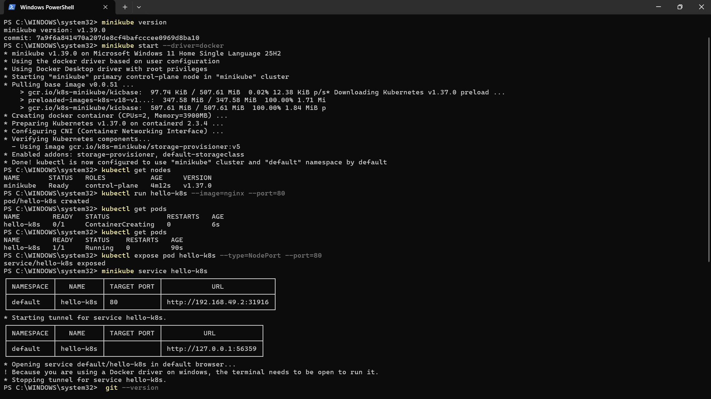
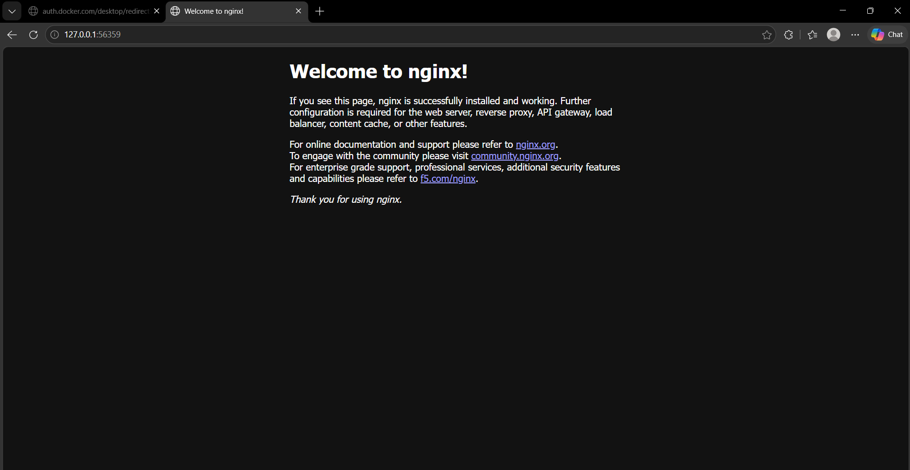

# Kubernetes Hands-On Exercise Series

**Exercise-1 Kubernetes (K8s) exercise!**

This activity helps us understand the basics of how Kubernetes runs and manages containerized applications.

## Business Problem (Zepto Example)

Imagine you are a **DevOps Engineer at Zepto**. The product team just built a lightweight **web app** that shows the **storefront and delivery status page** for customers.

Your task as the DevOps engineer:

**Deploy this app on Kubernetes** so that it is always running, portable, and can be scaled later. Simulate this using the popular `nginx` container image (think of it as Zepto's storefront web app).

## Exercise 1: Hello Pod

**Goal:** Run your first app inside Kubernetes and access it.

## Pre-Requisites

### 1. Install kubectl and Minikube (Windows, via winget)

```
winget install -e --id Kubernetes.kubectl
winget install -e --id Kubernetes.minikube
```

> Docker Desktop must be installed and running, since this exercise uses the **docker** driver.

## Steps: Deploy Nginx Image as a Pod

**1. Start a local Kubernetes cluster with Minikube:**

```
minikube start --driver=docker
```

**2. Confirm the cluster is ready:**

```
kubectl get nodes
```

**3. Create your first Pod (using Nginx image):**

```
kubectl run hello-k8s --image=nginx --port=80
```

**4. Verify the Pod is running:**

```
kubectl get pods
```



**5. Expose the Pod as a Service:**

```
kubectl expose pod hello-k8s --type=NodePort --port=80
```

**6. Open the app in your browser:**

```
minikube service hello-k8s
```

You should see the Nginx welcome page. **Congratulations, you just deployed your first container in Kubernetes!**

