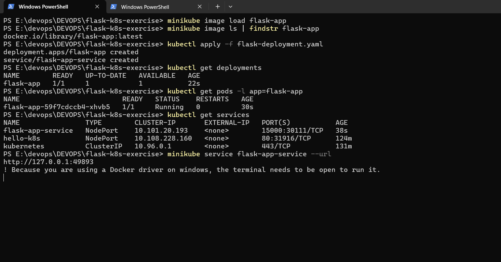
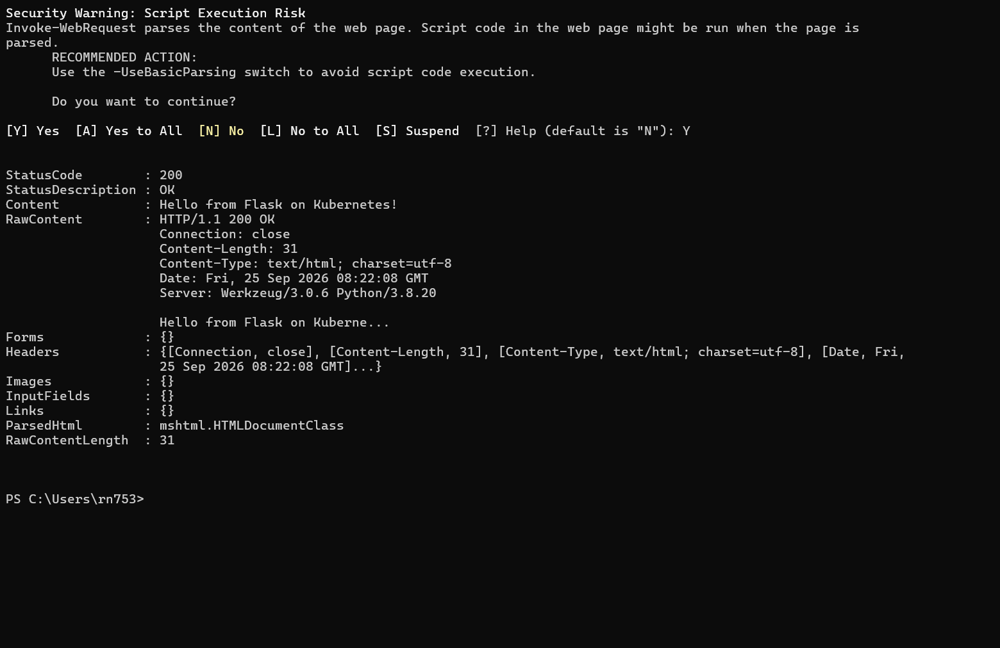

# Exercise 2: Deploy a Flask App on Minikube using kubectl and YAML

## Objective

Deploy a Python Flask application on a local Kubernetes cluster (Minikube) using a custom Docker image, a Deployment, and a Service.

## Steps

**1. Confirm Minikube is running**

```
minikube status
```

**2. Create the Flask app** (`app.py`)

```
from flask import Flask
app = Flask(__name__)

@app.route('/')
def home():
    return "Hello from Flask on Kubernetes!"

if __name__ == '__main__':
    app.run(host='0.0.0.0', port=15000)
```

**3. Create the Dockerfile**

```
FROM python:3.8-slim
WORKDIR /app
COPY . /app
RUN pip install flask
CMD ["python", "app.py"]
```

**4. Build the image**

```
docker build -t flask-app .
```

**5. Load the image into Minikube (Windows-specific step)**

On Windows, `eval $(minikube docker-env)` fails because Minikube's docker-env command tries to start an SSH agent, which isn't supported on Windows. Instead, build the image normally on the host's Docker Desktop, then load it directly into Minikube:

```
minikube image load flask-app
```

**6. Create the Deployment + Service YAML** (`flask-deployment.yaml`)

```
apiVersion: apps/v1
kind: Deployment
metadata:
  name: flask-app
spec:
  replicas: 1
  selector:
    matchLabels:
      app: flask-app
  template:
    metadata:
      labels:
        app: flask-app
    spec:
      containers:
      - name: flask-app
        image: flask-app:latest
        imagePullPolicy: Never
        ports:
        - containerPort: 15000
---
apiVersion: v1
kind: Service
metadata:
  name: flask-app-service
spec:
  selector:
    app: flask-app
  ports:
  - port: 15000
    targetPort: 15000
  type: NodePort
```

**7. Deploy it and verify**

```
kubectl apply -f flask-deployment.yaml
kubectl get deployments
kubectl get pods -l app=flask-app
kubectl get services
```



**8. Access the app**

```
minikube service flask-app-service --url
```

Keep this terminal open. In a new terminal:

```
curl http://127.0.0.1:<port>
```



Response: `Hello from Flask on Kubernetes!` — the Flask application is successfully deployed and reachable through the Kubernetes Service.

## Troubleshooting Notes

`eval $(minikube docker-env)` is a bash-specific command and fails on Windows with `SSH_AGENT_START: starting an SSH agent on Windows is not yet supported`. The workaround is to build the image on the host Docker Desktop as usual, then run `minikube image load <image-name>` to copy it into Minikube's internal image store, keeping `imagePullPolicy: Never` in the Deployment so Kubernetes uses that local image instead of trying to pull one. Additionally, `curl` on Windows is aliased to PowerShell's `Invoke-WebRequest`, which returns a structured object rather than plain text — the actual response body is in the `Content` field.