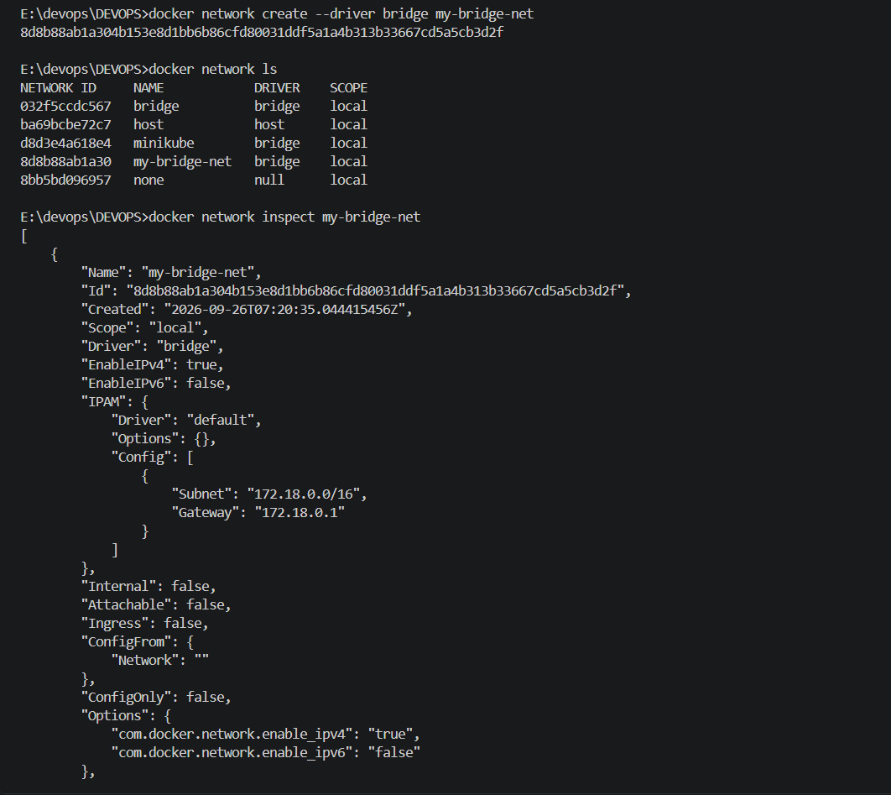
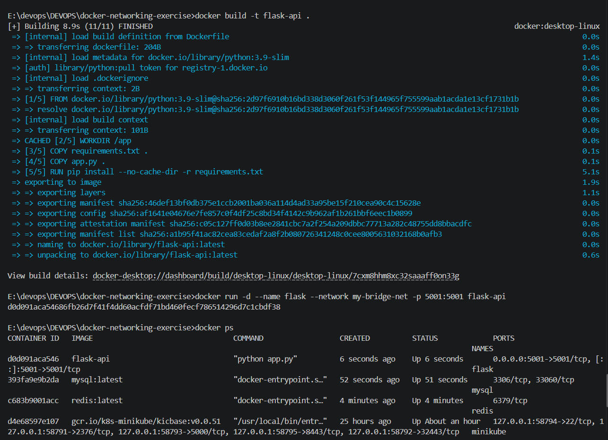
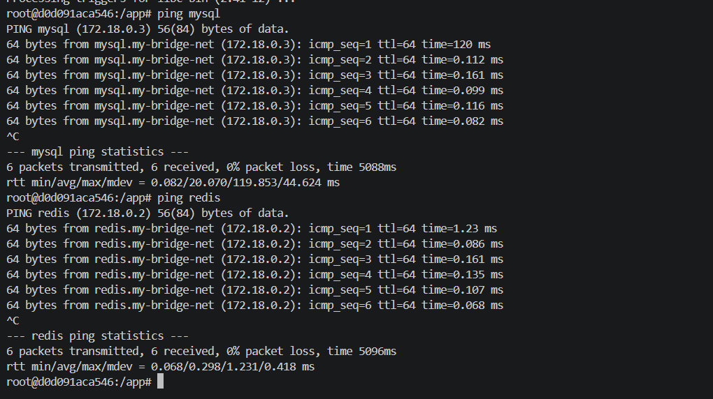
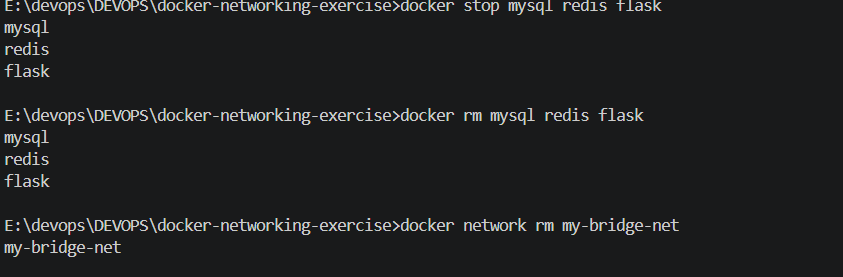

# Exercise 4: Docker Networking with Multiple Containers

## Objective

Understand Docker networking concepts and configure a multi-container application.

## Scenario

Develop a web application with:

* A Python Flask web server (container 1)
* A MySQL database (container 2)
* A Redis cache (container 3)

## Tasks

### Task 1: Create a Bridge Network

```
docker network create --driver bridge my-bridge-net
```

### Task 2: Verify the Network

```
docker network ls
```

### Task 3: Inspect the Network

```
docker network inspect my-bridge-net
```



### Task 4: Launch Containers

**app.py**

```python
from flask import Flask, jsonify

app = Flask(__name__)

@app.route('/about', methods=['GET'])
def about():
    return jsonify({
        "name": "Simple REST API",
        "version": "1.0",
        "description": "This is a simple REST API built with Flask."
    })

if __name__ == '__main__':
    app.run(debug=True, port=5001)
```

**requirements.txt**

```
Flask==2.0.1
Werkzeug==2.0.3
```

> Werkzeug is pinned alongside Flask because letting pip install the latest Werkzeug automatically breaks Flask 2.0.1 -- see Troubleshooting Notes below.

**Dockerfile**

```
FROM python:3.9-slim
WORKDIR /app
COPY requirements.txt .
COPY app.py .
RUN pip install --no-cache-dir -r requirements.txt
EXPOSE 5001
CMD ["python", "app.py"]
```

**Build the Flask image:**

```
docker build -t flask-api .
```

**Launch the containers:**

```
docker run -d --name mysql --network my-bridge-net -e MYSQL_ROOT_PASSWORD=root123 mysql:latest
docker run -d --name redis --network my-bridge-net redis:latest
docker run -d --name flask --network my-bridge-net -p 5001:5001 flask-api
```

> MySQL requires `MYSQL_ROOT_PASSWORD` (or an equivalent env var) to be set -- without it, the container starts and immediately exits. See Troubleshooting Notes.

**Verify all three are running:**

```
docker ps
```



### Task 5: Test Connectivity

Exec into the Flask container:

```
docker exec -it flask bash
```

The base image doesn't include `ping` by default, so install it first:

```
apt-get update && apt-get install -y iputils-ping
```

Ping the MySQL container:

```
ping mysql
```

Ping the Redis container:

```
ping redis
```



Both containers respond successfully, resolved by name (`mysql`, `redis`) to their internal IPs on the custom bridge network (`172.18.0.x`), confirming Docker's built-in DNS resolution works between containers on the same user-defined network.

### Task 6: Clean Up

```
docker stop mysql redis flask
docker rm mysql redis flask
docker network rm my-bridge-net
```



## Troubleshooting Notes

**MySQL won't start without a password.** The official `mysql` image refuses to initialize if none of `MYSQL_ROOT_PASSWORD`, `MYSQL_ALLOW_EMPTY_PASSWORD`, or `MYSQL_RANDOM_ROOT_PASSWORD` is set -- it exits immediately with `Database is uninitialized and password option is not specified`. Fix: always pass `-e MYSQL_ROOT_PASSWORD=<your-password>` on `docker run`.

**Flask 2.0.1 breaks with unpinned Werkzeug.** Pinning only `Flask==2.0.1` in `requirements.txt` lets pip install whatever the latest Werkzeug is at build time. Newer Werkzeug versions removed `url_quote`, which Flask 2.0.1 still imports internally, causing `ImportError: cannot import name 'url_quote' from 'werkzeug.urls'` and an immediate container crash. Fix: explicitly pin `Werkzeug==2.0.3` alongside Flask.

**`ping` isn't installed in `python:3.9-slim` by default.** Since it's a minimal Debian-based image, install it manually inside the running container with `apt-get update && apt-get install -y iputils-ping` before testing connectivity.

## Questions

**Q1: What is the purpose of the `--net` (or `--network`) flag in `docker run`?**
A: It specifies which Docker network the container should join, determining which other containers it can reach by name.

**Q2: How do containers communicate with each other on the same network?**
A: Containers on the same user-defined bridge network can reach each other using their container names as hostnames -- Docker provides automatic DNS resolution within that network.

**Q3: What is the difference between a bridge network and a host network?**
A: A bridge network isolates containers on their own private virtual network, with Docker handling internal DNS and routing between them. A host network removes that isolation entirely -- the container shares the host machine's network stack directly. Think of it like: Bridge Network -- containers are in a private room, talking to each other through a door. Host Network -- containers are in the same room as the host, talking directly to everyone.

**Q4: How can you expose a container's port to the host machine?**
A: Use the `-p` flag on `docker run`, e.g. `-p 5001:5001`, which maps a port on the host to a port inside the container.
